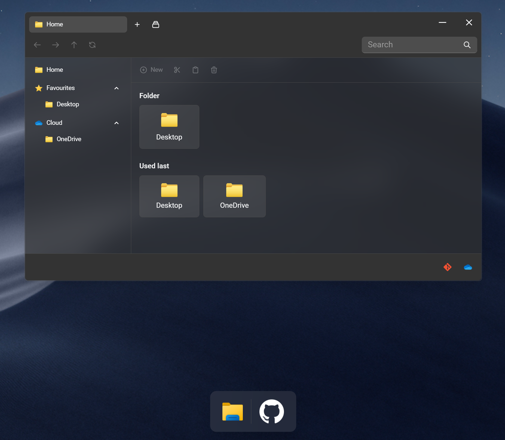
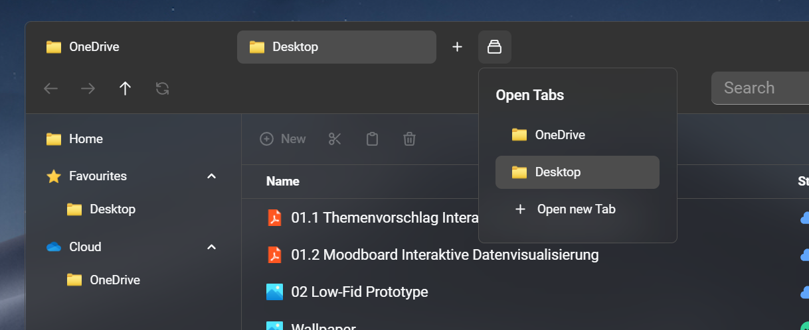
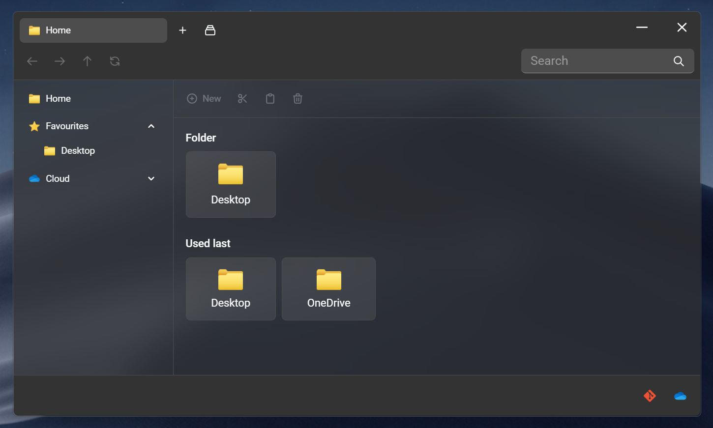
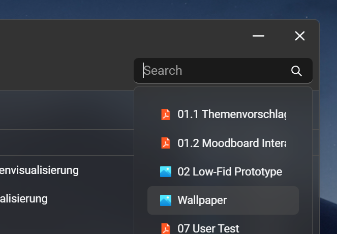
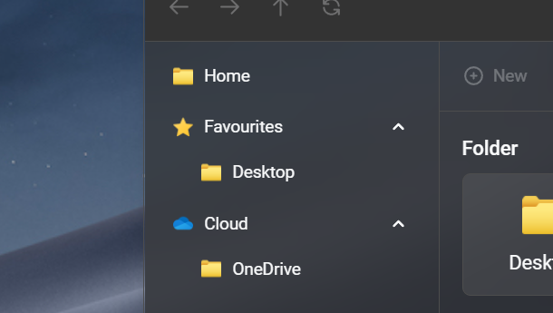
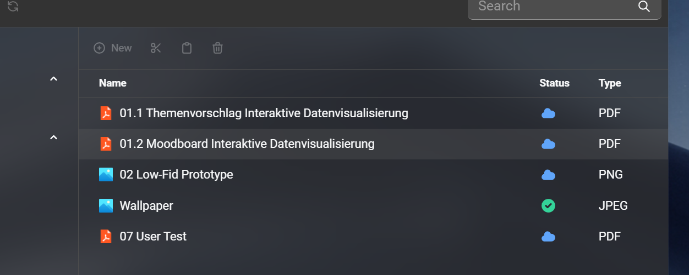

# 08 - Prototyp Enhancement / Dokumentation

Für den Überblick empfehle ich, einen kurzen Blick auf mein [Themenvorschlag](https://github.com/oezkancodes/IFD/blob/main/Aufgaben/01-User_Experience_Design/Themenvorschlag.pdf) von der ersten Aufgabe 01 zu werfen.

## Prototyp

- [Live Prototyp](https://vue-file-explorer-ifd.netlify.app/)
- [Repositoy](https://github.com/oezkancodes/vue-file-explorer)

Der Prototyp ist eine auf Vue basierte interaktive Webanwendung. Es imitiert eine einfache Desktopumgebung, die von MacOS und Windows inspiriert wurde. Für die beste Erfahrung empfehle ich, den Vollbildmodus zu aktivieren (gewöhnlich mit `F11` Taste).

Der Prototyp wurde als Erstes auf Basis von React entwickelt. Mitten in der Entwicklung bin ich dann auf Vue umgestiegen. Der Umstieg war nötig, da ich weitaus besser in Vue eingearbeitet war und die Implementierung zeitlich zu fordernd geworden ist. Die alte auf React basierte Live Demo ist [hier](https://react-file-explorer-ifd.netlify.app/) zugänglich und das Repository [hier](https://github.com/oezkancodes/react-file-explorer).

## Verbesserungen

Wie ich schon in der letzten Aufgabe [User Testing](/Aufgaben/07-User_Testing/User_Testing.pdf) erwähnt hatte, war der Prototyp zur Zeit des Testings nicht ausgereift genug, um sinnvolle User Testings durchzuführen. Aus diesem Grund hatte ich einen alternative File Explorer für das Testing genommen.

Ich habe den Fokus auf die Navigation gelegt und diesen Aspekt bei der Entwicklung erheblich verbessert. Zur Erinnerung möchte ich erwähnen, dass es um die Verbesserung des in Windows vorhandenen File Explorers geht.

Die erste Neuerung ist die Möglichkeit mehrere Tabs zu öffnen. Es soll dem Nutzer voneinander unabhängige Spaces bieten. Dazu wurde ein Tab Manager (Dropdown) implementiert, der bei der Navigation behilflich sein soll.

Eine weitere Verbesserung in der Navigation ist der Home Bereich, der in unterschiedliche Sektionen unterteilt ist und dazu noch größere und zugänglichere visuelle Elemente bietet.

Eine neue und im Gegensatz zum Windows Explorer funktionierende Suchfunktion wurde implementiert, um die Navigation zu erleichtern.

Währenddessen ist die Hauptnavigation jederzeit erreichbar und bietet eine einfache Navigation durch alle Ordner, sortiert nach Typ.

Im Desktop lassen sich unter anderem die Lösungen der in diesem Fach gelösten Aufgaben ansehen. Das klicken auf einen Eintrag führt zu den jeweiligen Dateien. Externe Files sind mit einem Cloud Icon in der Spalte Status zu erkennen. Lokale Dateien wie der Wallpaper, der im Einsatz ist, sind mit dem Check Icon zu erkennen. Der Status soll lokale- von Cloud-Dateien unterscheiden (simuliert).

## Weiteres

Nicht umgesetzt werden konnten komplexere Funktionen wie dem kopieren, ausschneiden und einfügen von Dateien, da es den Rahmen gesprengt hätte. Da der Fokus auf die Datenvisualisierung und das Interface liegen, wurden höhere Funktionalitäten, die dabei keine größere Rolle spielen würden, nach hinten gestellt.
