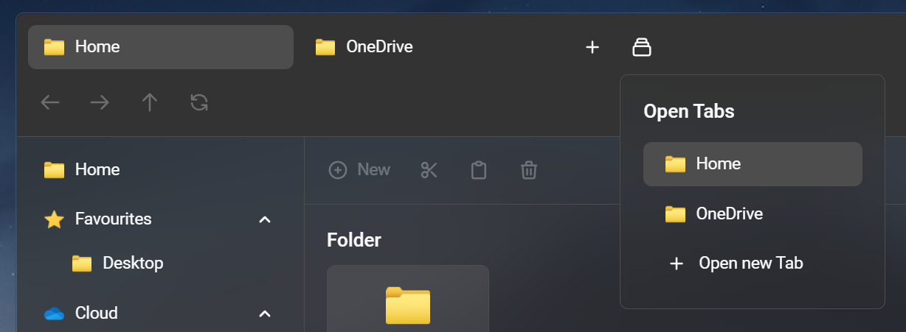

# Konzept eines Sprachassistenten

Ein Sprachassistent soll in den bereits entwickelten [File-Explorer Prototypen](https://vue-file-explorer-ifd.netlify.app/) eingebunden werden und dem Nutzer die Bedienung erleichtern.

Der Sprachassistent soll durch die Stimme, einem Kurzbefehl oder durch einen im File-Explorer platzierten Button gestartet werden können. 

Im Folgenden werden auf die relevanten Aspekte eines Sprachassistenten im File Explorer eingegangen.

## 1. Suchfunktion der Suchleiste

Durch einen Sprachassistenten lassen sich Dateien im gesamten System einfach finden.

Beispiel: "Suche nach _User Test_"

### 1.1 Dialog Flow

## 2. Öffnen von Dateien

Durch einen Sprachassistenten lässt sich eine angezeigte Datei nicht nur einfach öffnen, sondern auch mit anderen Programmen als in der Standardeinstellung starten.

Beispiel: "Öffne _Wallpaper_ mit _Affinity Photo_" 

### 2.1 Dialog Flow

## 3. Navigieren durch den File Explorer

Durch einen Sprachassistenten lässt sich der File-Explorer einfach navigieren und zwischen den offenen Tabs wechseln.

Beispiel: "Öffne zu _OneDrive_ in einem neuen Tab", "Schließe den Tab _OneDrive_"

### 3.1 Dialog Flow

## 4. (Optional) Ansicht sortieren und gruppieren

Durch einen Sprachassistenten lässt sich die Ansicht einfach umgestalten.

Beispiel: "Ändere die Ansicht auf _Detail-Ansicht_ und sortiere nach _Namen_" 

